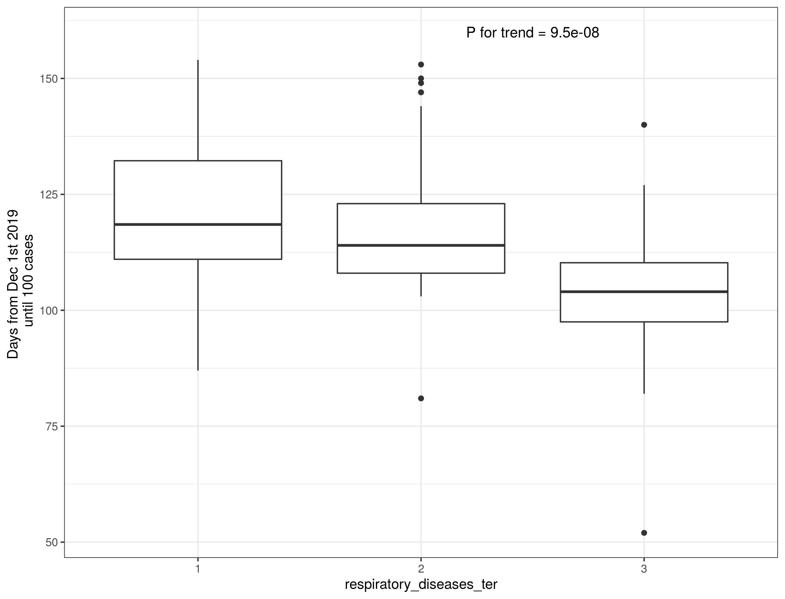
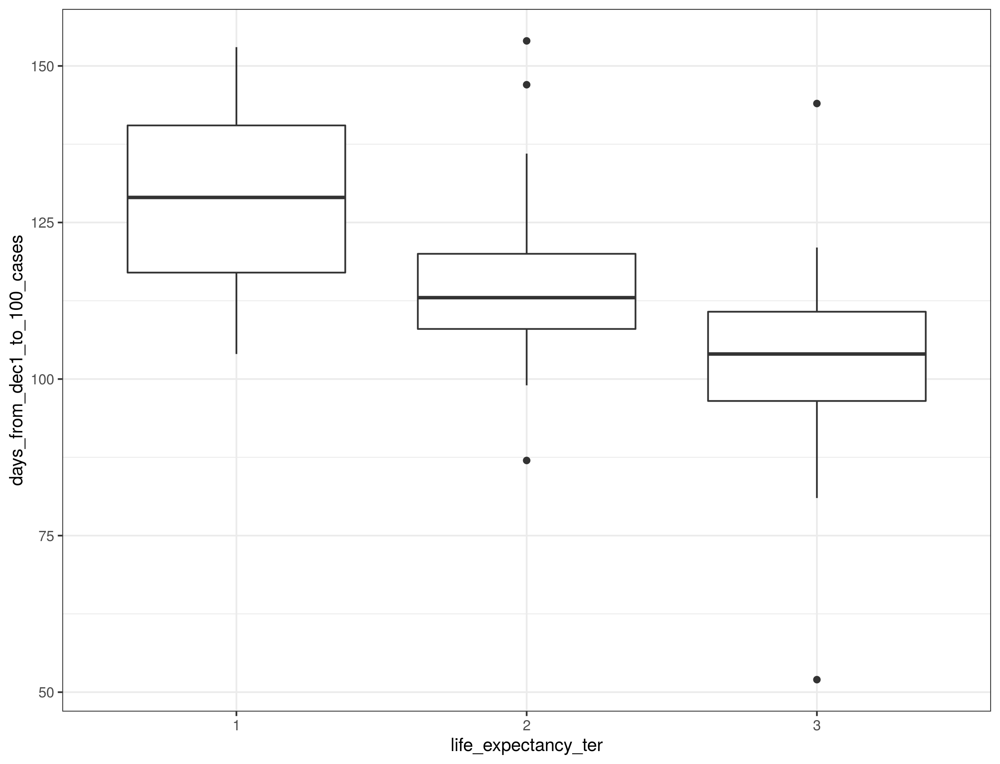

```{r setup, include=FALSE}
knitr::opts_chunk$set(echo = FALSE)
```

## Aim - hypothesis - inkl søjleplot og map plot Mette Chr

## Materiale - oversigt over dataset - Mette Christof

## Metode 1 - clean flowchart  - Mette Christof

## Metode 2 - analyse flowchart  - Mette Christof

## Results GIF - HJ

## Results - variable selection - Mette Chr

## Respiratory diseases
<div class="columns-2">
  <div class="centered">
  { width=70%, height=70% }
  {width=70%, height=70% }

  { width=110%, height=110% }
</div>

## Life expectancy
<div class="columns-2">
  <div class="centered">
  { width=70%, height=70% }
  {width=70%, height=70% }

  { width=110%, height=110% }
</div>

## Population % living in urban areas

<div class="columns-2">
  <div class="centered">
  { width=70%, height=70% }
  {width=70%, height=70% }

  { width=110%, height=110% }
</div>

## PCA analysis by population demographics
<div class="columns-2">
  <div class="centered">
  { width=105%, height=105% }
  
  - PCA showed a clear association with COVID-19 kinetics
  - Relative COVID-19 deaths were more informative than absolute deaths
  - PC1 comprises 44.6% of variation
   
  { width=60%, height=60% }

## PCA and cluster analysis
  <div class="columns-2">
  <div class="centered">
  { width=110%, height=110% }
  
  - Cluster analysis (n=3) based on population demographics data (middle) and on PCA (right) 
  - Cluster analysis does not capture COVID-19 kinetics accurately
  


## Shiny app - Mette Chr

## Sex leader - Mette Christof

## Conclusion slide - HJ


