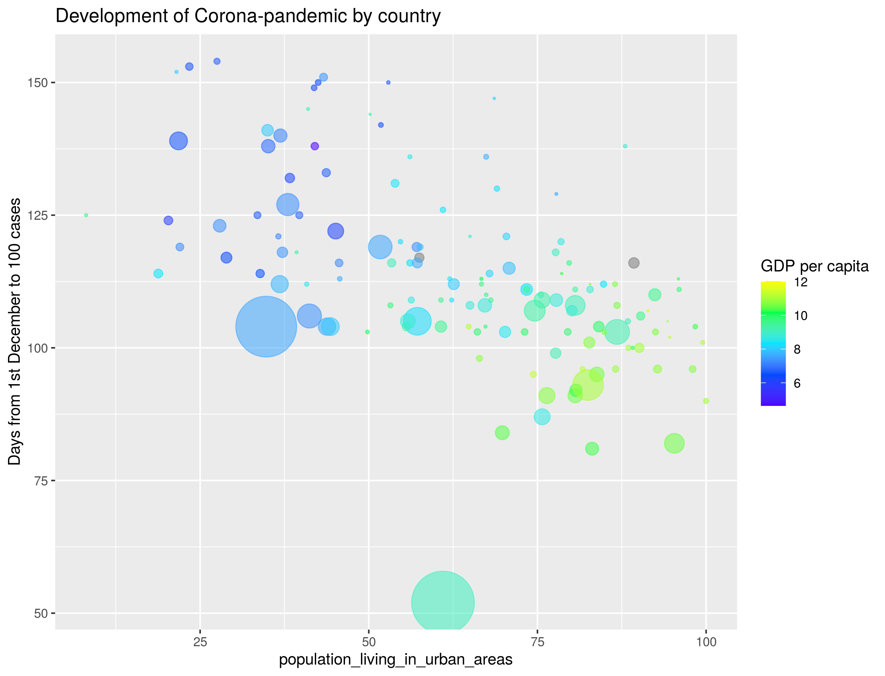
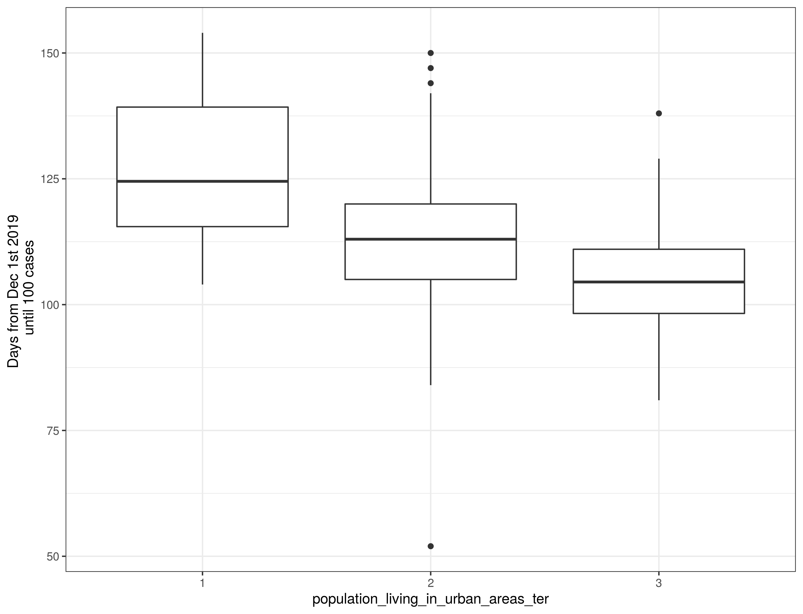

```{r setup, include=FALSE}
knitr::opts_chunk$set(echo = FALSE)
```


## Population living in urban areas

<div class="columns-2">

{ width=110%, height=110% }

<div class="centered">

  { width=70% }
  { width=70% }


</div>


