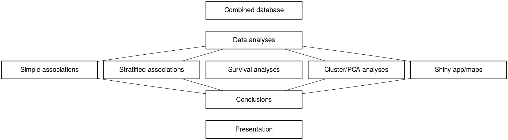
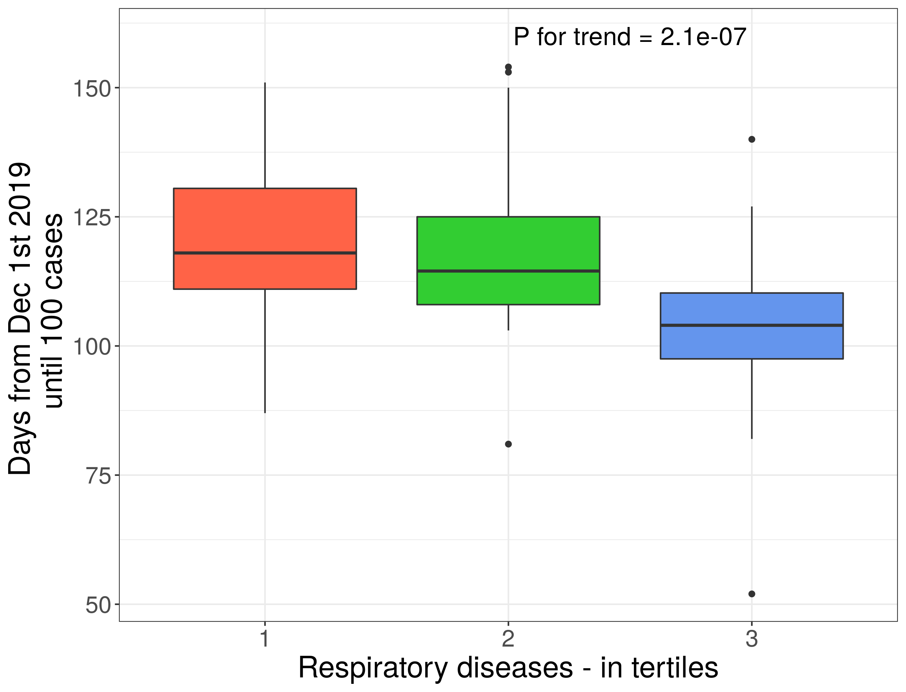
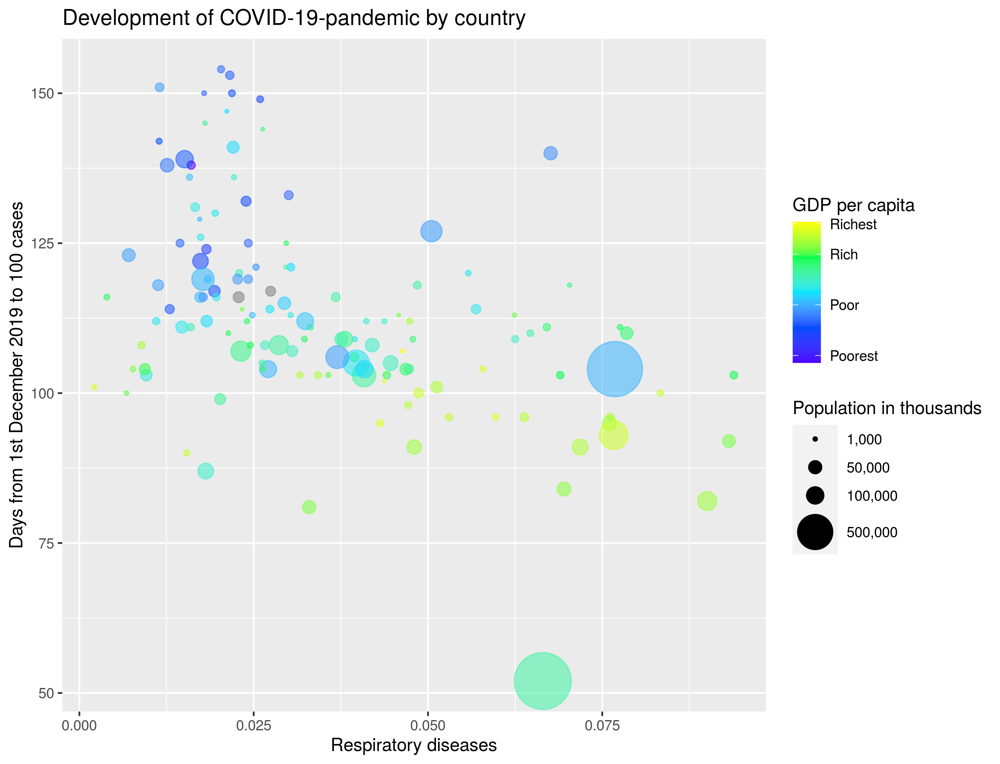
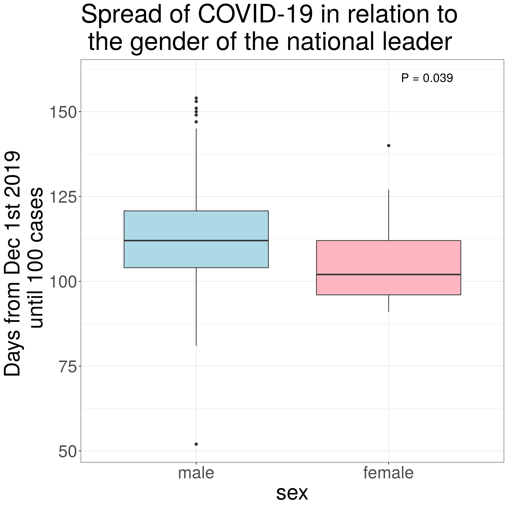

```{r setup, include=FALSE}
knitr::opts_chunk$set(echo = FALSE)
library("tidyverse")
library("knitr")
library("kableExtra")
```

## Background 

<div class="centered">
{ width=80%, height=80% }

<font size="4">[Global map - cumulative death until May 4th](map_number_of_covid_19_related_deaths.html)</font>

## Aim and hypothesis
<div class="black">
<br>
<font size="6"> Aim:</font> <br>
<font size="5"> Linking exposure variables (publicly available demograhic/population data etc) to:</font> <br>
<font size="4"> 1. Days from December 1st 2019 to 100 COVID-19 cases <br> - as a measure of worldwide spread of COVID-19 <br>
2. Days from 100 confirmed COVID-19 cases to 100 COVID-19 derived deaths <br> - as a measure of nationwide spread of, and capability to deal with, COVID-19 </br> </font> 
<br>
<br>
<font size="6"> Hypothesis:</font> <br>
<font size="5"> Population demographics, public health and capacity of health care systems affects COVID-19 kinetics</font>
</div>

## Datasets - overview of data 
<div class="centered">
{ width=60%, height=60% }
{ width=80%, height=80% }
</div>

## Datasets - cleaning, augmenting and joining
<div class="centered">
{ width=100%, height=100% }
</div>
<div class="black">
<br>
<font size="5"> Specific challenges: </font> <br>
<font size="4"> 1. Ensuring identical naming of countries across data sources <br>
2. Large number of data sources and exposure variables </font> <br>
</div>

## Datasets - cleaning, augmenting and joining
<div class="centered">
{ width=100%, height=100% }
</div>
<div class="black">
<br>
<font size="5"> Solutions: </font> <br>
<font size="4"> 1. Creating a simple function for renaming countries <br>
2. Using (a lot of) for loops </font> <br>
</div>

## Methods - study design
<div class="centered">
{ width=90%, height=90% }</div>
<div class="black">
<br>
<font size="4">Non-course packages</font> <br>
<font size="3">
Lubridate (converting to date)
; PMCMRplus (p-values, Cuzick Test)
; DiagrammeR + DiagrammeRsvg + rsvg (flowcharts)
; leaflet (making world maps)
; htmlwidgets (saving interactiv plots)
; survivalAnalysis (Survival analysis)
; gganimate and gifski (making and saving gif)
; scales (modify scales on ggplot)</font>
</div>

## COVID-19 cases and deaths in each country


## Results - selection of exposure variables 
<div style="float: left; width: 40%;"> <div class="black"> <font size="4"> Selected exposure variabels: </font> <br>
<font size="3"> - Life expectancy <br>
- Population living in urban areas <br>
- Respiratory disease <br>
- Pollution attributable death rate <br>
- Health expenditure per person <br>
- Proportion of population >60 years <br>
__________________________________________________________________________________________________________________________________________</font> <br>
</div>
<br>
<div class="black"> <font size="4"> Linear regression analysis </font> <br> <font size="3">  - Outcome: 'Days from Dec 1st 2019 to 100 cases' <br> - Significant correlations: </font>
</div></div>
<div style="float: right; width: 60%;">
{ width=80%, height=80% }
<br>
<br>
<br>
```{r include=FALSE, paged.print=FALSE}

covid_aug <- read_tsv(file = "../data/03_covid_aug.tsv")

covid_aug_by_country <- covid_aug %>% 
  group_by(country) %>% 
  slice(which.max(date)) 


# Linear regression - COVID-19 cases and covariates
# ------------------------------------------------------------------------------

#Check for correlation between covariates

model1 <- lm(days_from_dec1_to_100_cases ~ life_expectancy + pollution_attributable_death_rate_std +
               current_health_expenditure_per_person_usd + population_living_in_urban_areas +
               population_aged_60_years_old_percentage + respiratory_diseases, data = covid_aug_by_country)

summary(model1)


model1_final <- lm(days_from_dec1_to_100_cases ~ life_expectancy + 
               population_living_in_urban_areas + respiratory_diseases, data = covid_aug_by_country) 
 
model1_final<-summary(model1_final)


model2 <- lm(days_from_100_cases_to_100_deaths ~ life_expectancy + pollution_attributable_death_rate_std +
               current_health_expenditure_per_person_usd + population_living_in_urban_areas +
               population_aged_60_years_old_percentage + respiratory_diseases, data = covid_aug_by_country)

summary(model2)


```

```{r Table 1, echo=FALSE, paged.print=FALSE, results="asis"}

cor_covar = round(coefficients(model1_final), digits = 6) 

cor_covar %>% 
  kable(caption = "Table 1. Correlation between covariats", format = "html") %>% 
  kableExtra::kable_styling(position = "center", font_size = 12, bootstrap_options = "striped", full_width = FALSE)


```

## Life expectancy
<div class="columns-2">
  <div class="centered">
  { width=70%, height=70% }
  {width=70%, height=70% }

  { width=110%, height=110% }
   - <font size="3"> Life expectancy clearly positively associates with COVID-19 case- and mortality kinetics (p=0.021, log-rank test)</font>
</div>


## Respiratory diseases
<div class="columns-2">
  <div class="centered">
  { width=70%, height=70% }
  {width=70%, height=70% }

   { width=110%, height=110% }
   - <font size="3"> A similar, but somewhat weaker, association was seen for respiratory diseases (p<0.001, log-rank test) </font>
</div>

## Population % living in urban areas

<div class="columns-2">
  <div class="centered">
  { width=70%, height=70% }
  {width=70%, height=70% }

  { width=110%, height=110% }
     - <font size="3"> Likewise, a positive association was seen for % of the population living in urban area (p=0.013, log-rank test)</font>

</div>

## PCA analysis by population demographics
<div class="columns-2">
  <div class="left">
  { width=105%, height=105% }
  
  - <font size="3"> PCA showed a clear association with COVID-19 kinetics </font>
  - <font size="3"> Relative COVID-19 deaths more informative than absolute </font>
  - <font size="3"> PC1 comprises 44.6% of variation </font>
  - <font size="3"> Life expentancy strongest driver of PC1 </font>
  { width=60%, height=60% }

## PCA and cluster analysis
  <div class="columns-2">
  <div class="left">
  { width=100%, height=100% }
  
  - <font size="3"> Cluster analysis (n=3) based on population demographics data (middle) and on PCA </font>
  - <font size="3"> Cluster analysis does not capture COVID-19 kinetics accurately </font>


## COVID-19 app

<div class="left">

Confirmed cases, test and death in time series 

<font size="4">https://r-kursus.shinyapps.io/covid_app/</font>


## Another explanation? {.flexbox .vcenter}
<div class="columns-2">
<div class="centered">
{ width=100%, height=100% }

{ width=50%, height=100% }
{ width=50%, height=100% }
</div>

</div>

## Another explanation? {.flexbox .vcenter}
<div class="columns-2">
<div class="centered">
{ width=100%, height=100% }
<div class="black">
OR JUST CONFOUNDING BY DEVELOPMENTAL STATUS OF THE COUNTRIES...
</div>
{ width=100%, height=100%}
</div>
<font size="4">[Global map - days from december 1st to 100 cases](map_days_from_dec1_to_100_cases.html)</font>

## Conclusion - A small virus in a world full of data
  { width=30%, height=30%}
   
  
  - This project demonstrates the strength of Tidyverse R by cleansing, transformation, visualization and communication of COVID-19 data
  - Performed focusing on reproducibility
  - All data analysis is available at github (https://github.com/rforbiodatascience/2020_group02)


