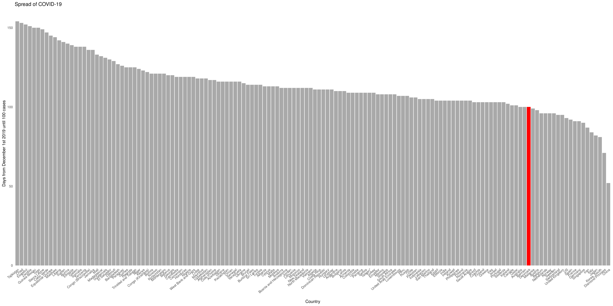
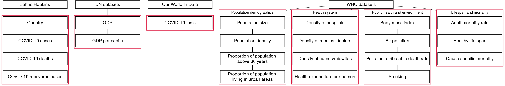
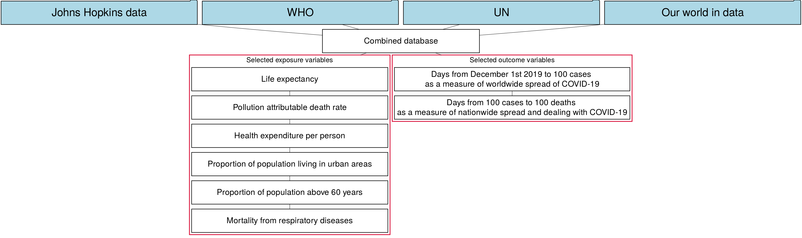
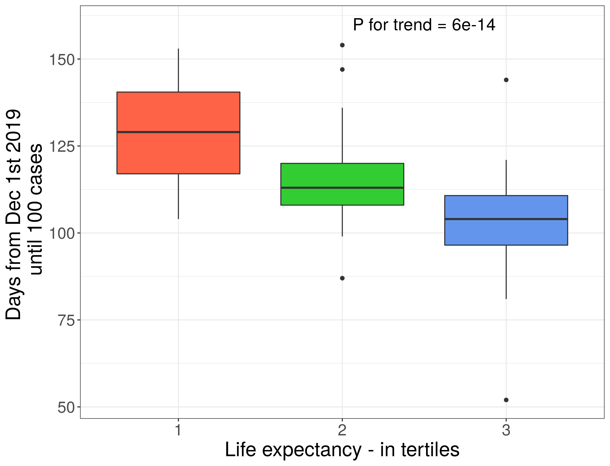
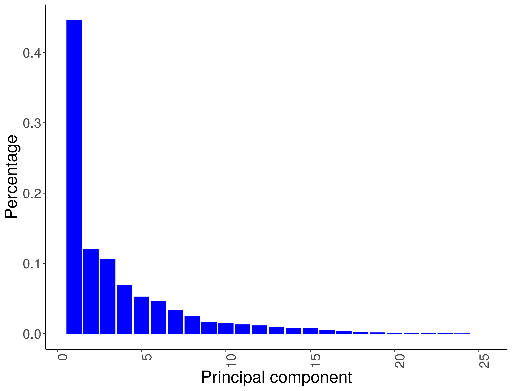
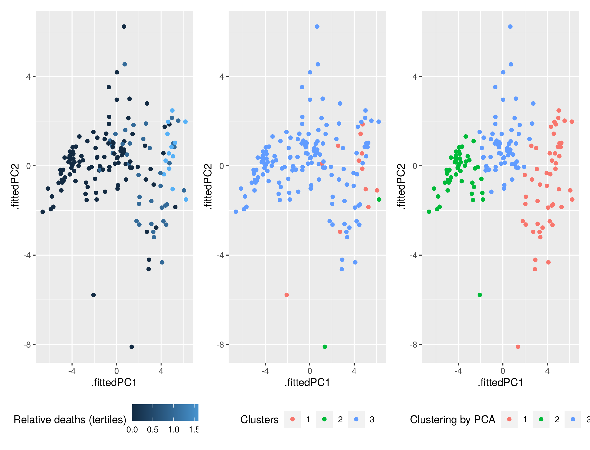

```{r setup, include=FALSE}
knitr::opts_chunk$set(echo = FALSE)
library("tidyverse")
library("knitr")
library("kableExtra")

```
## Aim and hypothesis 

- Aim: Linking COVID-19 and demograhic/population data 
- Hypothesis: That factors like urbanisation and median population age affects COVID-19 kinetics

<font size ="3">
- [Global map - days from 100 cases to 100 deaths](map_days_from_100_cases_to_100_deaths.html)
<font size ="3">
- [Global map - days from 100 cases to 100 deaths](map_days_from_dec1_to_100_cases.html)
<div class="centered">
{width=60%, height=60% }


## Datasets - overview of data
<div class="centered">
{ width=80%, height=80% }
</div>

## Datasets - cleaning, augmenting and joining
<div class="centered">
{ width=80%, height=80% }
</div>


## Methods - study design
<div class="centered">
{ width=80%, height=80% }
</div>

## Covid-19 cases and deaths in each country


## Results - variable selection 

- Liniar correlation analysis lm(days from dec1 to 100 cases ~ diff. variables)
- Significant correlations:

```{r include=FALSE, paged.print=FALSE}

covid_aug <- read_tsv(file = "../data/03_covid_aug.tsv")

covid_aug_by_country <- covid_aug %>% 
  group_by(country) %>% 
  slice(which.max(date)) 


# Linear regression - COVID-19 cases and covariates
# ------------------------------------------------------------------------------

#Check for correlation between covariates

model1 <- lm(days_from_dec1_to_100_cases ~ life_expectancy + pollution_attributable_death_rate_std +
               current_health_expenditure_per_person_usd + population_living_in_urban_areas +
               population_aged_60_years_old_percentage + respiratory_diseases, data = covid_aug_by_country)

summary(model1)


model1_final <- lm(days_from_dec1_to_100_cases ~ life_expectancy + 
               population_living_in_urban_areas + respiratory_diseases, data = covid_aug_by_country) 
 
model1_final<-summary(model1_final)


model2 <- lm(days_from_100_cases_to_100_deaths ~ life_expectancy + pollution_attributable_death_rate_std +
               current_health_expenditure_per_person_usd + population_living_in_urban_areas +
               population_aged_60_years_old_percentage + respiratory_diseases, data = covid_aug_by_country)

summary(model2)


```


```{r Table 1, echo=FALSE, paged.print=FALSE, results="asis"}

cor_covar = round(coefficients(model1_final), digits = 6) 

cor_covar %>% 
  kable(caption = "Table 1. Correlation between covariats", format = "html") %>% 
  kableExtra::kable_styling(position = "center", font_size = 12, bootstrap_options = "striped", full_width = FALSE)


```


## Respiratory diseases
<div class="columns-2">
  <div class="centered">
  { width=70%, height=70% }
  {width=70%, height=70% }

   { width=110%, height=110% }
</div>

## Life expectancy
<div class="columns-2">
  <div class="centered">
  { width=70%, height=70% }
  {width=70%, height=70% }

  { width=110%, height=110% }
</div>

## Population % living in urban areas

<div class="columns-2">
  <div class="centered">
  { width=70%, height=70% }
  {width=70%, height=70% }

  { width=110%, height=110% }
</div>

## PCA analysis by population demographics
<div class="columns-2">
  <div class="centered">
  { width=105%, height=105% }
  
  - PCA showed a clear association with COVID-19 kinetics
  - Relative COVID-19 deaths were more informative than absolute deaths
  - PC1 comprises 44.6% of variation
   
  { width=60%, height=60% }

## PCA and cluster analysis
  <div class="columns-2">
  <div class="centered">
  { width=110%, height=110% }
  
  - Cluster analysis (n=3) based on population demographics data (middle) and on PCA (right) 
  - Cluster analysis does not capture COVID-19 kinetics accurately
  


## COVID-19 app

<div class="centered">

 - Confirmed cases, test and death in time series 

https://r-kursus.shinyapps.io/covid_app/


## Sex leader - Mette Christof
<div class="columns-2">
<div class="centered">
{ width=100%, height=100% }
</div>

## Conclusion slide - HJ


